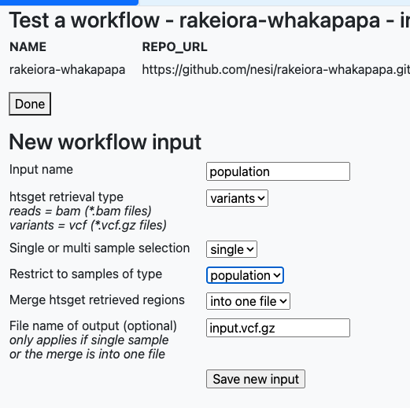

# rakeiora-whakapapa
whakapapa workflow for rakeiora

Author: [Alastair.Lamont@otago.ac.nz] (mailto:alastair.lamont@otago.ac.nz)

Current version: 1.1

With minor folder structure adjustments to run in Rakeiora.

To use in [the Rakeiora sandbox] (https://test.rakeiora.ac.nz), define a single input of htsget_type=variants,
"single" selection (it will only run on one population), restrict
selection to type "population", and merge into one file whose name
is input.vcf.gz (as nominated in the Snakefile).



You can make the bedfile optional in the sandbox, which means the workflow will run on the entire genome file. However, at the time of this writing, this option is not yet available in Rakeiora generally (only the sandbox). To use in the [Rakeiora analysis area] (https://analyse.rakeiora.ac.nz), you will need to provide a bedfile. Chromosome 22 bedfile is provided in the `resources` directory (`population1.bed`).

## Singularity construction

In Rakeiora, the workflow will be executed in a singularity which 
is built as follows:

Download and extract rrBLUP package from
https://cran.r-project.org/web/packages/rrBLUP/index.html
(this used version 4.6.2)

Builder a docker image:

```
docker build -t nesi/whakapapa:1.0 - < Dockerfile
```

Create a singularity from this local docker image:

```
singularity build whakapapa_1.0.sif docker-daemon://nesi/whakapapa:1.0
```

Rakeiora team will make this singularity available in Rakeiora as

```
    /shared/singularities/whakapapa_1.0.sif
```
See https://test.rakeiora.ac.nz/app/sandbox/shared.xsql for info
on all available Rakeiora hosted singularities.

The single rule workflow runs an R script on the multi-sample VCF
file (pulled back from Rakeiora when appropriate population level
visa has been granted), along with the phenotype and pedigree
information (mother and father relationships).

## Phenotype and pedigree Data

Initially, the phenotype and pedigree information is provided as part of the
workflow (see alea/simdatafull and alea/simped103id).
After ALEA is configured to contain and provide this data, it will be retrieved
from ALEA. This is obviously sensitive information that will not be stored
in a public repository unless it is public anonymised information, or fabricated
for testing purposes.

## Change log
Version 1.0 - Initial release Nov 23 2023

Version 1.1 Nov 29 2023

- move stuff to a config file (so that `snakemake --lint` is happy)
- loop over multiple methods (GBLUP and ssGBLUP, as configured in config.yaml)
- split stdout (output) from stderr (logs)
